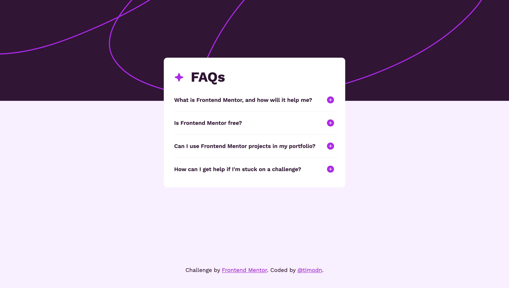

# Frontend Mentor - FAQ accordion solution

This is a solution to the [FAQ accordion challenge on Frontend Mentor](https://www.frontendmentor.io/challenges/faq-accordion-wyfFdeBwBz). Frontend Mentor challenges help you improve your coding skills by building realistic projects. 

## Table of contents

- [The challenge](#the-challenge)
- [Screenshot](#screenshot)
- [Links](#links)
- [Built with](#built-with)
- [What I learned](#what-i-learned)
- [Continued development](#continued-development)
- [Author](#author)

### The challenge

Users should be able to:

- Hide/Show the answer to a question when the question is clicked
- Navigate the questions and hide/show answers using keyboard navigation alone
- View the optimal layout for the interface depending on their device's screen size
- See hover and focus states for all interactive elements on the page

### Screenshot

### Links

- Solution URL: https://your-solution-url.com
- Live Site URL: https://your-live-site-url.com

### Built with

- CSS custom properties
- Flexbox
- [React](https://reactjs.org/) - JS library

### What I learned

Another simple yet heuristic react app I made.

### Continued development

I would like to continue learning more about React hooks.

## Author

- Frontend Mentor - [@timodn](https://www.frontendmentor.io/profile/timodn)